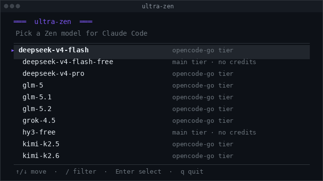
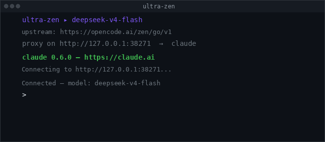

# ultra-zen

[](https://go.dev/)
[](https://github.com/raketenkater/ultra-zen/actions/workflows/ci.yml)
[](LICENSE)
[](https://goreportcard.com/report/github.com/raketenkater/ultra-zen)

<picture>
  <source media="(prefers-color-scheme: dark)" srcset="ultra-zen-selector.png">
  
</picture>

Run **Claude Code** on **opencode Zen models** (the full `opencode-go` tier:
glm, kimi, minimax, qwen, deepseek, grok, mimo, hy3-preview, plus the `*-free`
models) or **OpenRouter free models** — with full Claude Code feature parity
(Ultracode workflows, subagents, MCP, hooks, WebFetch, tools, streaming).

`ultra-zen` is a launch wrapper around Claude Code. It reads your opencode API
key (or an OpenRouter key from the environment), lists available models, lets
you pick one from a searchable TUI, starts a local **Anthropic → OpenAI
translation proxy**, and execs `claude` pointed at it. Claude Code only speaks
the Anthropic Messages API; a thin bridge translates to the OpenAI Chat
Completions format the upstream gateways serve.

```
ultra-zen
  ├─ read API key (auth.json or OPENROUTER_API_KEY)
  ├─ fetch live model list
  ├─ TUI model selector
  ├─ start proxy (goroutine) 127.0.0.1:<free port>
  │     Anthropic /v1/messages  →  OpenAI /chat/completions
  │     /v1/models advertises available ids (subagent model probe)
  │     tools · streaming SSE · reasoning_content handling
  ├─ build claude env (stripped auth, local base URL, tier mapped)
  ├─ inject --settings (Workflow stallMs hook) + DDG MCP for web research
  └─ exec claude "$@"   (proxy torn down on exit)
```

## Install

```bash
curl -fsSL https://raw.githubusercontent.com/raketenkater/ultra-zen/main/install.sh | sh
```

Or with Go:

```bash
go install github.com/raketenkater/ultra-zen/cmd/ultra-zen@latest
```

From source:

```bash
git clone https://github.com/raketenkater/ultra-zen
cd ultra-zen
make build
```

### Prerequisites

- **Claude Code** on `PATH` (`npm i -g @anthropic-ai/claude-code`).
- **opencode** logged in with the `opencode-go` provider:
  `opencode auth login` → select the opencode provider. The API key is read
  from `~/.local/share/opencode/auth.json` (or `~/.config/opencode/auth.json`).
- **OpenRouter API key** (for `--provider openrouter`):
  get one at [openrouter.ai/keys](https://openrouter.ai/keys).
- **uvx** (optional) for web research — `ultra-zen` wires a no-key DuckDuckGo
  MCP in place of the Anthropic-only `WebSearch` tool.

## Usage

```bash
ultra-zen                                    # TUI selector → opencode Zen
ultra-zen --provider openrouter              # OpenRouter free models
ultra-zen glm-5.1                            # skip the selector
ultra-zen kimi-k2.6 -- --resume              # args through to claude
ultra-zen --list                             # list models and exit
ultra-zen --list --provider openrouter       # list OpenRouter free models
ultra-zen --proxy-only glm-5.1               # proxy only (debugging)
ultra-zen --port 8787 glm-5.1                # pin a port
ultra-zen --version                          # print version

# Orchestrator/worker split — smart model plans, cheap model fans out
ultra-zen glm-5.1 --worker mini-max-m2.5
```

Flags must come **before** the model argument (standard Go flag parsing):
`ultra-zen --port 9000 --provider openrouter`.

### Backends

**opencode Zen** (default, `--provider opencode-go`): reads your opencode API
key from `auth.json`. Lists `opencode-go` tier models and `*-free` models.

**OpenRouter** (`--provider openrouter`): reads `OPENROUTER_API_KEY` from the
environment. Lists `:free` models, including `qwen/qwen3-coder:free`,
`deepseek/deepseek-chat:free`, `google/gemini-2.5-flash:free`, and
`openrouter/free` (auto-routes to the best available free model).

### Orchestrator / worker split

`--worker <model>` runs two models behind one proxy. The main Claude Code loop
uses the orchestrator model; background sub-agents spawned by Ultracode
workflows use the worker model.

The proxy classifies requests by inspecting the tool list. The main loop
carries interactive tools (`AskUserQuestion`, `Skill`, `EnterPlanMode`) that
sub-agents never see. A request with those tools goes to the orchestrator;
everything else goes to the worker.

```bash
ultra-zen glm-5.1 --worker mini-max-m2.5       # go tier
ultra-zen kimi-k3 --worker deepseek-v4-flash-free  # free worker
```

## How it works

### Model selection
`ultra-zen` fetches the live model list from the active backend:

- **opencode-go tier** (`https://opencode.ai/zen/go/v1`) — models the
  `opencode-go` key can access.
- **free tier** (`https://opencode.ai/zen/v1`) — `*-free` models.
- **OpenRouter** (`https://openrouter.ai/api/v1`) — `:free` models and
  `openrouter/free`.

### Translation proxy
The proxy (`internal/proxy`) translates both directions:

| Anthropic (Claude Code)          | OpenAI (upstream)               |
|----------------------------------|----------------------------------|
| `system` (string or blocks)      | `messages[0]` role `system`      |
| `messages[].content` blocks      | `content` / `tool_calls` / `tool` |
| `tools[].input_schema`           | `tools[].function.parameters`    |
| `tool_choice`                    | `tool_choice`                    |
| `stop_reason`                    | `finish_reason`                  |
| SSE `message_start`…`message_stop` | SSE `data:` chunks             |

Reasoning models emit their answer in `reasoning_content`; the proxy surfaces
it as a text block so Claude Code never sees an empty message.

### Claude Code environment
The launcher sets:

- `ANTHROPIC_BASE_URL` → the local proxy
- `ANTHROPIC_AUTH_TOKEN=ultra-zen`, `ANTHROPIC_MODEL` + all tier vars → selected model
- Watchdog/timeouts relaxed so a remote model never trips idle timers
- `CLAUDE_AUTOCOMPACT_PCT_OVERRIDE=60` (compact early for smaller context windows)

<picture>
  <source media="(prefers-color-scheme: dark)" srcset="ultra-zen-launch.png">
  
</picture>

### Ultracode / Workflow support
A `PreToolUse` hook rewrites Workflow `agent()` scripts to set `stallMs` to
the maximum safe value, so background fan-out never aborts a quiet model.

### Web research
The Anthropic-only `WebSearch` tool is disabled and replaced with a
DuckDuckGo MCP (`mcp__ddg-search__search`, `mcp__ddg-search__fetch_content`)
when `uvx` is present.

## Project layout

```
cmd/ultra-zen/      entry point: selector + launcher + provider dispatch
internal/auth/      opencode auth.json reader (or env for OpenRouter)
internal/models/    live model list from Zen gateway or OpenRouter
internal/proxy/     Anthropic↔OpenAI translation (request/response/stream)
internal/claude/    env build + settings injection + exec
internal/tui/       Bubble Tea model selector
internal/workflow/  Workflow script rewriter (stallMs injection hook)
```

## License

MIT
